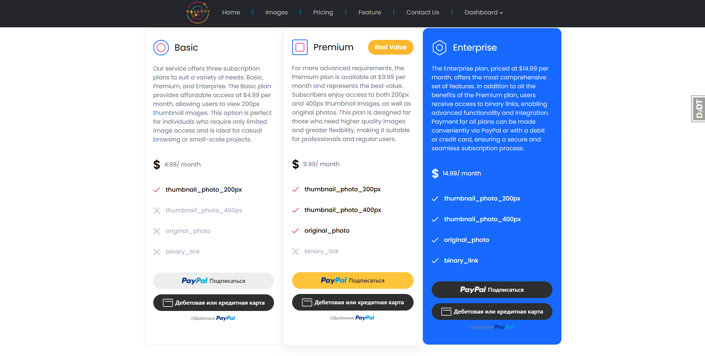
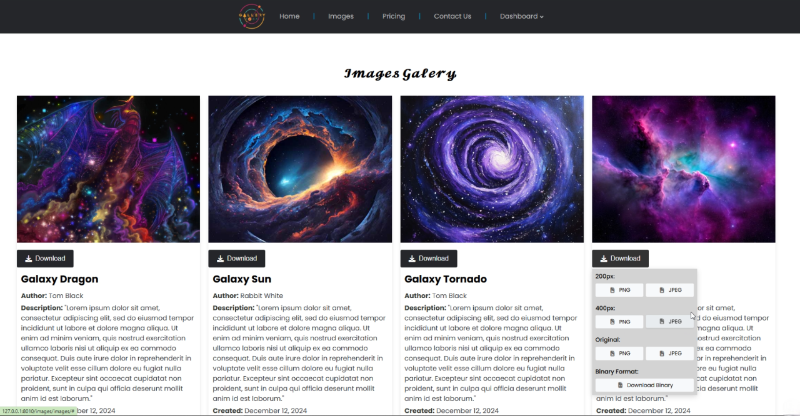
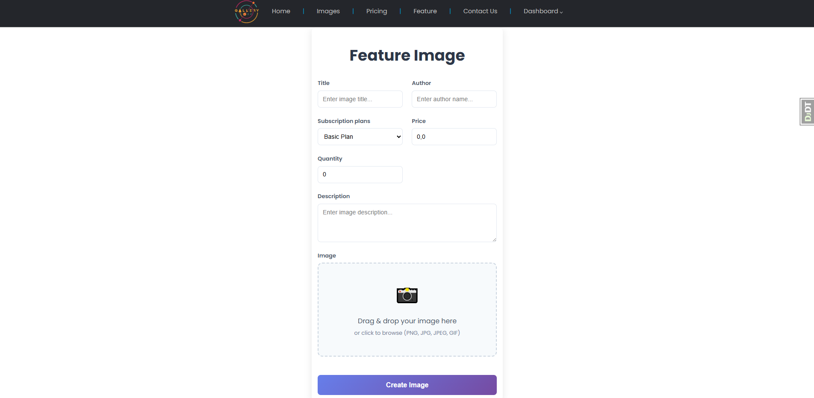
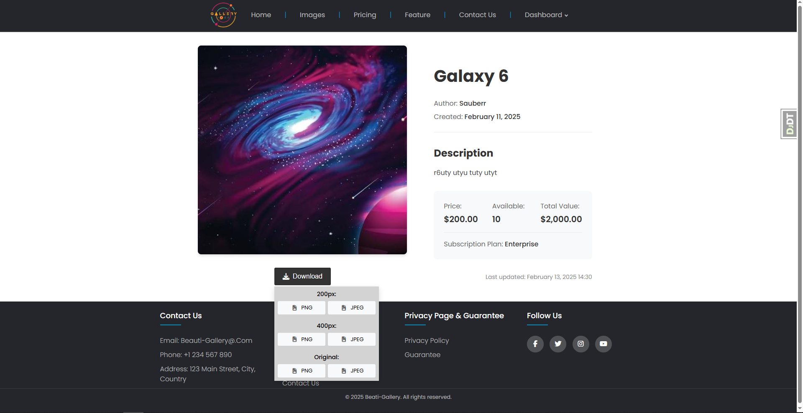
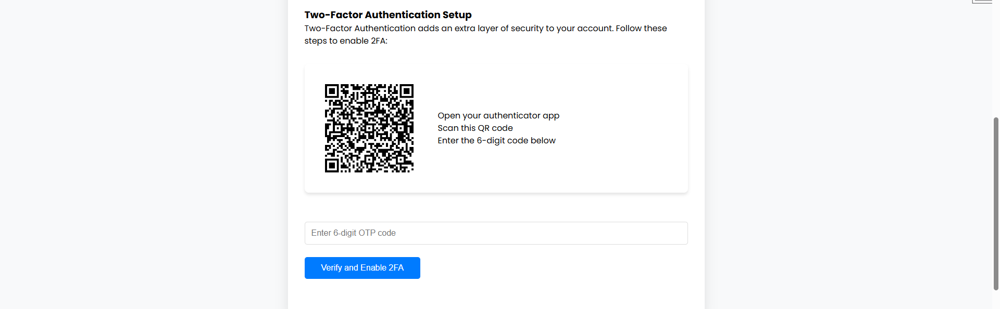
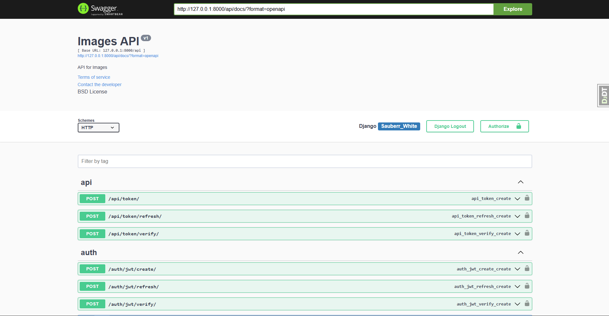
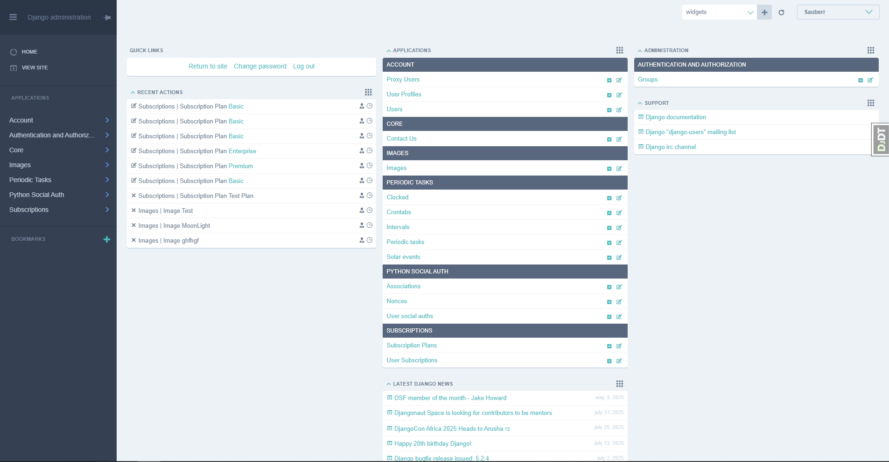
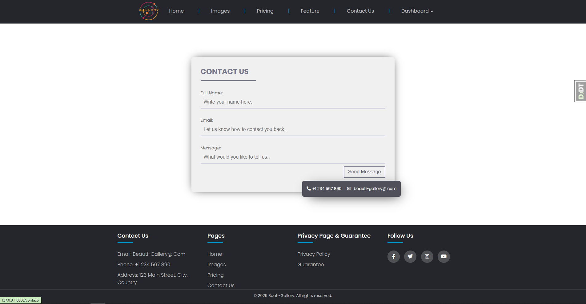

<h1 align="center"> 🎨 Gallery - Online Subscription Art Service 🎨 </h1>

<p align="center">
  
  
  </br>
  
  
  </br>
  
  
  </br>
  
  
  
  </br>
</p>

<h1 align="left"> 📋 About</h1> 

</br>

Gallery is a sophisticated online subscription service where users can discover and download unique artworks from talented artists around the world. Built with Django 4.2+ and Python 3.12+, this platform offers a premium art discovery experience through flexible subscription plans powered by secure PayPal integration.

The service features three carefully crafted subscription tiers — Basic, Premium, and Enterprise — each providing access to different levels of exclusive content and features. Users can explore an extensive collection of high-quality artworks through an intelligent search system powered by Elasticsearch, ensuring lightning-fast and precise results.

Gallery prioritizes security and user experience with comprehensive authentication options, including social login integration, two-factor authentication (2FA), email verification, and flexible login methods via email or phone number.

The platform leverages advanced caching strategies using Redis and Django-Cachalot for optimal performance and seamless user interactions. Cross-Origin Resource Sharing (CORS) is properly configured to enable secure API access from different domains while maintaining strict security policies.

This project exemplifies modern web development practices with a robust CI/CD pipeline, comprehensive test coverage (85%), and clean, maintainable code enforced by industry-standard tools like Flake8, Ruff, isort, and Black.

The platform also features custom JavaScript implementations for enhanced user interactions, including intuitive photo download functionality and dynamic timer-based messaging systems.

## Stack:

 - **Backend**: [**`Python 3.12+`**](https://python.org/)
 - **Frontent**: HTML, CSS, JavaScript with AJAX for seamless interaction
 - **Framework**: [**`Django 4.2+`**](https://djangoproject.com/)
 - **Database**: [**`PostgreSQL`**](https://postgresql.org/)
 - **Search Engine**: [**`Elasticsearch 8.0+`**](https://elastic.co/elasticsearch)
 - **Cache**: [**`Redis`**](https://redis.io/) with [**`Django-Cachalot`**](https://django-cachalot.readthedocs.io/)
 - **Task Queue**: [**`Celery`**](https://docs.celeryq.dev/en/stable/)
 - **API**: [**`Django REST Framework`**](https://django-rest-framework.org/)
 - **Deployment**: [**`Docker`**](https://docker.com/)
 - **Web Server**: [**`Nginx`**](https://nginx.org/) & [**`Gunicorn`**](https://gunicorn.org/)

<div align="center">


  









 
 

</div>

## 🚀 Features

* **User Registration**: Sign up with email or phone verification; all users start without any plans.
* **Authentication**: Social media login (Google, GitHub), two-factor authentication (2FA), JWT tokens, custom email/phone login.
* **Artwork Download**: Download unique artworks through subscription plans with PayPal payment processing.
* **Subscription Plans**:
  * **Basic**: Access to 200px thumbnail.
  * **Premium**: Access to 200px and 400px thumbnails + original image.
  * **Enterprise**: All Premium features + expiring binary image links.
  * **Custom Plans**: Admins can create plans with custom thumbnail sizes, original image access, and expiring links via Django Admin.
* **Search**: Elasticsearch integration for fast and efficient artwork search and filtering.
* **Frontend**: Responsive interface (HTML, CSS, JS) with custom JavaScript for photo downloads and timer-based messages.
* **Performance**: Optimized with Redis caching and Django-Cachalot for global caching, Celery for background tasks.
* **Testing**: 85% test coverage with comprehensive unit and API tests using pytest and Faker for test data.
* **Admin Interface**: Manage users, subscriptions, artworks, and artist content via Django Admin.
* **API**: Fully functional REST API with JWT authentication, filters, and search capabilities.
* **Code Quality**: Maintained with Flake8, Ruff, isort, Black, and Django-Stubs for enhanced type safety.
* **Database Optimization**: SQL query performance optimization using select_related and Redis caching.
* **Payment Processing**: Secure PayPal integration for subscription management.
* **CI/CD Pipeline**: Automated deployment and quality control with robust testing.

## 🛠️ Local Development

1. **Clone the repository:**
   ```bash
   git clone https://github.com/Sauberr/gallery.git
   cd gallery
   ```

2. **Create and activate virtual environment:**
   ```bash
   python3.12 -m venv ../venv
   source ../venv/bin/activate  # On Windows: ..\venv\Scripts\activate
   ```
   
3. **Install dependencies with Poetry:**
   ```bash
   poetry update
   poetry install
   ```

4. **Configure environment variables:**
   ```bash
   cp .env.example .env
   ```
   
   Open `.env` file and fill in all required environment variables:
   
   ```env
   # Django Configuration
   DEBUG=True
   SECRET_KEY=django-insecure-your-secret-key-here
   DOMAIN_NAME=http://localhost:8000/
   
   # Database Configuration (PostgreSQL)
   DATABASE_NAME=gallery
   DATABASE_USER=postgres
   DATABASE_PASSWORD=postgres
   DATABASE_HOST=localhost
   DATABASE_PORT=5432
   
   # Other required variables...
   ```

5. **Set up database:**
   ```bash
   # Create PostgreSQL database (make sure PostgreSQL is installed and running)
   createdb gallery_db
   
   # Run migrations
   ./manage.py migrate
   
   # Load fixture data (optional)
   ./manage.py loaddata <path_to_fixture_files>
   ```

6. **Create Django superuser:**
   ```bash
   ./manage.py createsuperuser
   ```

7. **Start Elasticsearch:**
   ```bash
   # Using Docker
   docker run -d --name elasticsearch -p 9200:9200 -p 9300:9300 \
     -e "discovery.type=single-node" \
     -e "xpack.security.enabled=false" \
     elasticsearch:8.0.0
   
   # Or install Elasticsearch locally and run
   elasticsearch
   ```

8. **Start Redis server:**
   ```bash
   # Using Docker
   docker run -it --rm --name redis -p 6379:6379 redis
   
   # Or install Redis locally and run
   redis-server
   ```

9. **Start Celery worker (in a separate terminal):**
   ```bash
   # Activate virtual environment first
   source ../venv/bin/activate
   
   # Start Celery worker
   celery -A app worker -l INFO --pool=solo
   ```

10. **Run the Django development server:**
    ```bash
    ./manage.py runserver
    ```

11. **Access the application:**
    - **Main site**: http://localhost:8000
    - **Admin panel**: http://localhost:8000/admin
    - **API documentation**: http://localhost:8000/api/docs/

## 🐳 Docker Deployment

### Quick Start
```bash
# Build and start all services
docker-compose up -d --build

# View logs
docker-compose logs -f

# Stop all services
docker-compose down
```

### Create superuser via Docker
```bash
docker-compose exec web python manage.py createsuperuser
```

### Load fixture data via Docker
```bash
docker-compose exec web python manage.py loaddata <path_to_fixture_files>
```

### Run tests via Docker
```bash
docker-compose exec web python manage.py test
```

Full API documentation with interactive testing is available at `/api/docs/` when running the development server.

## 📞 Contact 

To contact the author of the project, write to email **dmitriybirilko@gmail.com**
